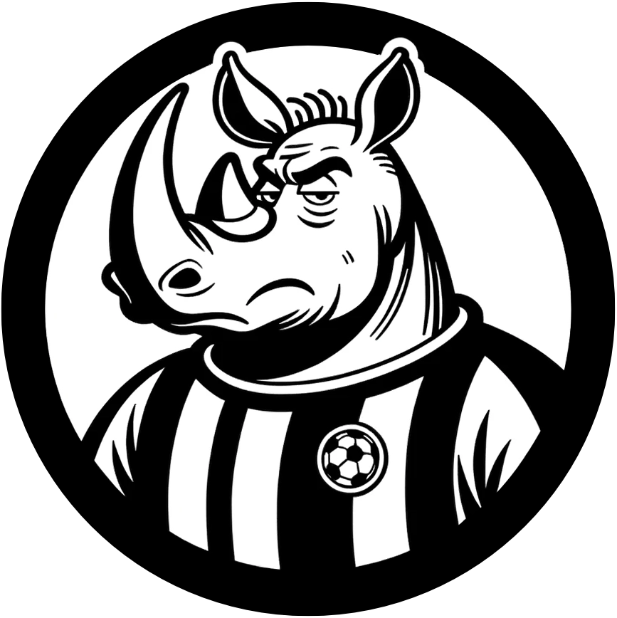
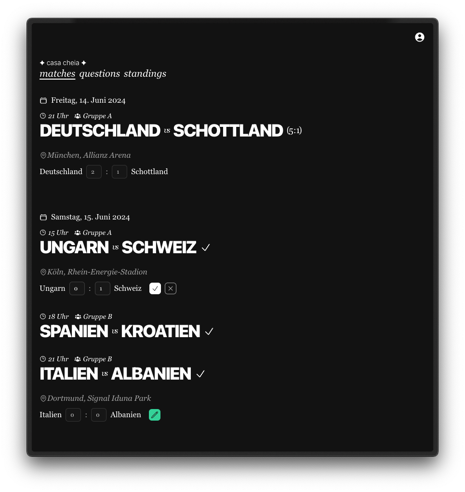

    
    <h1>Tipperino</h1>

    
Companion app for the UEFA Euro 2024. Create groups, invite friends and predict the outcome of the games.

    
Built with Nuxt, Nuxt UI, NuxtHub, Nuxt Auth Utils, Drizzle & Vitest. 💚

    <a href="https://github.com/nuxt-hub/starter">Generated from nuxt-hub/starter</a>
     
    

## Run it yourself

Copy `.env.example` to `.env` and fill in required values.  
Run `pnpm dev`.

## todos

- [ ] create faq-page
- [ ] persist groups in local storage
